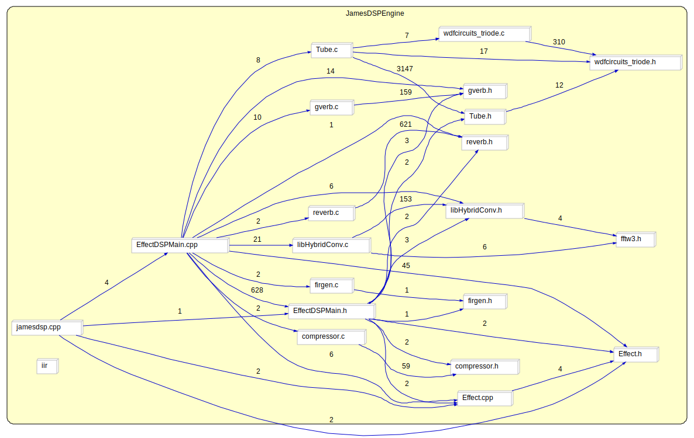

# JamesDSPManager (Audio Effect Digital Signal Processing library for Android)
GUI is based on Omnirom DSP Manager and able to run on most Android devices from 5.0 - 8.1 include Samsung, AOSP, Cyanogenmod, recent HTC and Huawei. 
This app in order to improve your music experience especially you want realistic bass and more natural clarity.

##### Features:

1. Compression
2. Bass Boost

   --> 2048/4096 order FIR linear phase bass boost
3. Reverberation

   --> Progenitor 2 (Complicated IIR network)
4. FIR Equalizer (Cubic spline interpolated 15 bands equalizer)[How smooth it is?](https://github.com/james34602/JamesDSPManager/blob/master/SmoothEq.svg)
5. Stereo Widen
6. BS2B
7. Partitioned Convolver (Auto segmenting selection)

   --> Support mono, stereo, full/true stereo(LL, LR, RL, RR) IR
   
   --> Samples per channels for stereo impulse response should less than 1000000
   
   --> Samples per channels for full stereo impulse response should less than 500000

8. Vacuum tube modelling
9. Viper DDC (IIR Cascaded Second-Order Sections Form II)
10. Time-frequency analysis based spatializer (Close source)

##### Supported bit depth:

| # bits   | Status      |
|----------|-------------|
| 8        | Unsupported |
| 16       | Supported   |
| 24(Int)  | Unsupported |
| 32(Int)  | Supported   |
| 32(Float)| Supported   |

## Important
### FAQ
#### 1. Computation datatype?

A: Float32(Close source due to proprietary spatialization algorithm) / Float64, depend on which version you install.

#### 2. Bass boost filter type?

A: Effect has 2 options to boost low frequency band, IIR based is obsoleted, equalizer already do the job.

   Filtering is work on convolution basis. When user change the bass boost parameter, engine will compute new low pass filter(with gain) impulse response using firls, a function ported from Matlab.
   
   2048/4096 order FIR filter should work on all frequency listed on options.

#### 3. What is convolver?

A: Convolver is a effect apply convolution(a mathematical operation) on audio signal, that perfectly apply user desired impulse response on music, it could simulate physical space.

   Effect itself require audio file(.wav/.irs/.flac) to become impulse response source.

   For more info: [Convolution](https://en.wikipedia.org/wiki/Convolution) and [Convolution reverb](https://en.wikipedia.org/wiki/Convolution_reverb)

#### 4. Low audio quality compared to other DSP like Viper#^$DROID?

A: This probably impossible from all algorithms perspective. All algorithms has been precisely measured on time domain, frequency domain, input/output characteristic, etc with mathematics/numerical analysis software.

I put much time on Auto Convolver engine and it's calibration in order to provide accurate result that same(#1) as MATLAB conv(), but not losing any performance.

How about other reasons that bring down quality?
1. Your Android audio framework is not supported, this not uncommon on HTC devices.
2. Audio amplitude clipped(#2), this is a obvious reason which produce strange sound, try to turn your volume down!
3. ~~If you are using convolver, did you try to use smaller normalise~~(#3)~~value, which control overall impulse response amplitude level.~~
4. Tube modelling require a high performance CPU to output best quality, so I turn down algorithm precision. **This may produce low amplitude noise.

#1: Floating point rounding issue is not taken into account.

#2: JamesDSP use limiter to reduce clipping harshness.

#3: This option have been changed to simple gain control.

#### 5. What is Analog Modelling?

A: Analog Modelling internal work as a vacuum tube amplifier, was designed by [ZamAudio](https://github.com/zamaudio).
The tube they used to model is 12AX7 double triode. They also provide a final stage of tonestack control, it make sound more rich. However, the major parameters is amplifier preamp, this is how even ordered harmonic come from, but this parameter have been limited at maximum 12.0. Input audio amplitude is decided by user, thus louder volume will generate more harmonics and internal amplifier will tend to clip the audio. Analog amplifier was built from real mathematical model, most notably is nonlinearity of vacuum tube.
Original is written in C++, for some reasons I ported it to C implementation.

#### Example circuit for triode amplifier and tonestack:


#### 6. What is Misc folder does?

File reverbHeap is modified Progenitor 2 reverb, memory allocation is using heap not stack, it will be useful when you play around with Visual Studio, because VS have 1Mb stack allocation limit...

#### 7. Why libjamesdsp.so so big?

A: Because of fftw3 library linked.

#### 8. Why open source? Any license?

A: Audio effects actually is not hard to implement, I don't think close source basic audio effects is a good idea. Many audio effects is exist in the form of libraries, or even in thesis, everyone can implement it...
   All files in this repository is published under GPLv2.

#### 9. Can I use your audio effect code?

A: Yes. It is relatively easy to use some effect in other applications. Convolver, reverb, 12AX7 tube amplifier source code is written in similar style, you can look at the how their function is called, initialised, processed, etc. Most of the effect is written in C, so it is easy to port to other platforms without huge modifications.

#### 10. Installation method

A: Advanced method(Manual installation)

   Effect may get unloaded by Android system if no audio stream for while.

  audio_effects.conf is a file specified for system to load effect using known UUID.
  1. you need to add
   ```
  jdsp {
    path /system/lib/soundfx/libjamesdsp.so
  }
   ```
   ### under
   ```
   bundle {
    path /system/lib/soundfx/libbundlewrapper.so
  }
   ```
   ### AND
   ```
   jamesdsp {
    library jdsp
    uuid f27317f4-c984-4de6-9a90-545759495bf2
  }
   ```
   ### under
   ```
   effects {
   ```
   2. copy libjamesdsp.so to /system/lib/soundfx
   3. Reboot
   4. Install APK

B: Automatic installation(Supported up to Android Pie)

   Join Telegram group [JDSP and V4A group](https://t.me/jDSP_V4A) to receive latest update.
   Methods:
   1. Copy zip package to your phone, reboot to custom recovery, install package, reboot, done.
   2. Get Magisk manager to install JDSP.
Now work on most Android device from Lollipop to Pie

##### Algorithms included in non open source version
1. Arbitrary response IIR library
 - Traditional IIR filters
 - Least square optimized frequency response modeller
 - Minimum phase / Mixed phase filters
 - Pole-zero manipulation tool
 - Matrix and polynomial operation functions
 - Available for sale
2. Various time-frequency based stereo to N-channels upmixing algorithms

##### Coming up:
1. Auto-detected bit rates MP3 high frequency harmonic excitor

## Download Link
1. See my project release page

# Screenshot
1. [Equalizer screenshot(Dark theme)](https://github.com/james34602/JamesDSPManager/blob/master/ScreenshotMainApp1.png)
2. [Convolver screenshot(Idea theme)](https://github.com/james34602/JamesDSPManager/blob/master/ScreenshotMainApp2.png)

# Important
Modify SELinux is not required(in most case), let your device become safer.
Also, it's good to customizing your own ROM or even port ROM with JamesDSP.

# Contact
Better contact me by email. Send to james34602@gmail.com

# Terms and Conditions / License
The engine frame is based on Antti S. Lankila's DSPManager.

Current project compatibility and new features supported by James Fung.

Android framework components by Google

Source code is provided under the [GPL V2](https://www.gnu.org/licenses/old-licenses/gpl-2.0.html)

### Credit
1. Joseph Young (Impulse response provider)
2. Christopher Blomeyer (Very patient app tester and inspiring me bit depth issue)
3. [ahrion](https://github.com/therealahrion) (Making installation tools)
4. [Zackptg5](https://github.com/Zackptg5) (Making installation tools)

#### More Credit
1. Matlab, for verifying algorithm correctness

# Structure map generated by Understand (Hosted on rawgit)

